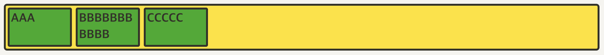

# CSS

### Flex 아이템에 적용하는 속성

##### flex-basis

```css
.item {
  flex-basis: 100px
}
```

- width가 100px이 안 되는 AAA와 CCC는 100px로 늘어났고, 원래 100px이 넘는 BBB는 그대로 유지된다

  

```css
.item {
  width: 100px
}
```

- 원래 100px을 넘는 BBB도 100px로 맞춰진다

  

[그림 참고](https://studiomeal.com/archives/197)

