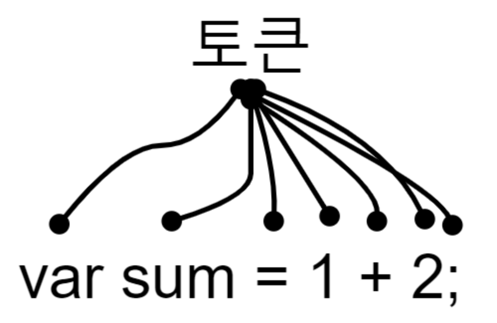
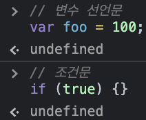
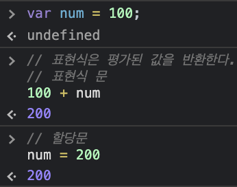

# 값, 식, 문

## 값(value)

- 식(표현식)(expression)이 평가되어 생성된 결과를 말한다. 여기서 평가란 식을 해석해서 값을 생성하거나 참조하는 것을 의미한다.

  ```javascript
  // 예시
  10 + 20; // 30
  
  // 변수에는 10 + 20이 평가되어 생성된 숫자 값 30이 할당된다
  var sum = 10 + 20;
  ```

- 값은 다양한 방법으로 생성할 수 있는데, 가장 기본적인 방법은 리터럴을 사용하는 것이다.

  - 내용 추가 필요

## 식(표현식)(expression)

- 식은 값으로 평가될 수 있는 문(statement)이다. 즉, 식이 평가되면 새로운 값을 생성하거나 기존 값을 참조한다.

- 리터럴은 값으로 평가되므로 리터럴도 식이다.

- 식은 리터럴, 식별자(변수, 함수 등의 이름), 연산자, 함수 호출 등의 조합으로 이뤄질 수 있다. 다양한 식이 있지만, 값으로 평가된다는 점은 모두 동일하다. 즉, 값으로 평가될 수 있는 문은 모두 식이다.

  ```javascript
  // 리터럴 표현식
  10
  'Hello'
  
  // 식별자 표현식(선언이 이미 존재한다고 가정)
  sum
  person.name
  arr[1]
  
  // 연산자 표현식
  10 + 20
  sum = 10
  sum !== 10
  
  // 함수/메서드 호출 표현식(선언이 이미 존재한다고 가정)
  square()
  person.getName()
  ```

## 문(statement)

- 프로그램을 구성하는 기본 단위이자 최소 실행 단위이다. 문은 여러 토큰으로 구성되는데, 토큰이란 문법적인 의미를 가지며, 문법적으로 더 이상 나눌 수 없는 코드의 기본 요소를 의미한다.

  

## 표현식인 문과 표현식이 아닌 문

- 표현식인 문은 값으로 평가될 수 있는 문이며, 표현식이 아닌 문은 값으로 평가될 수 없는 문이다.

  ```javascript
  // 변수 선언문은 값으로 평가될 수 없으므로 표현식이 아니다.
  var x;
  
  //1, 2, 1 + 2, x = 1 + 2는 모두 표현식이다.
  // x = 1 + 2는 표현식이면서 완전한 문이기도 하다.
  x = 1 + 2;
  ```

- 표현식인 문과 표현식이 아닌 문을 구별하는 가장 간단한고 명료한 방법은 변수에 할당해 보는 것이다. 표현식인 문은 값으로 평가되므로 변수에 할당할 수 있다. 하지만 표현식이 아닌 문은 값으로 평가할 수 없으므로 변수에 할당하면 에러가 발생한다.

  ```javascript
  // 변수 선언문은 표현식이 아닌 문이다.
  var x;
  
  // 할당문은 그 자체가 표현식이지만 완전한 문이기도 하다. 즉, 할당문은 표현식인 문이다.
  x = 100;
  
  // 표현식이 아닌 문은 값처럼 사용할 수 없다.
  var foo = var x; // SyntaxError: Unexpected token var
  
  // 표현식인 문은 값처럼 사용할 수 있다.
  var foo = x = 100;
  console.log(foo); // 100
  ```

## 완료값

크롬 개발자 도구에서 표현식이 아닌 문을 실행하면 언제나 `undefined`를 출력한다. 이를 완료 값이라 한다. 완료 값은 표현식의 평가 결과가 아니다. 따라서 다른 값과 같이 변수에 할당할 수 없고 참조할 수도 없다.



개발자 도구에서 표현식이 아닌 문을 실행하면 완료 값 `undefined`를 출력한다.



크롬 개발자 도구에서 표현식인 문을 실행하면 언제나 평가된 값을 반환한다.