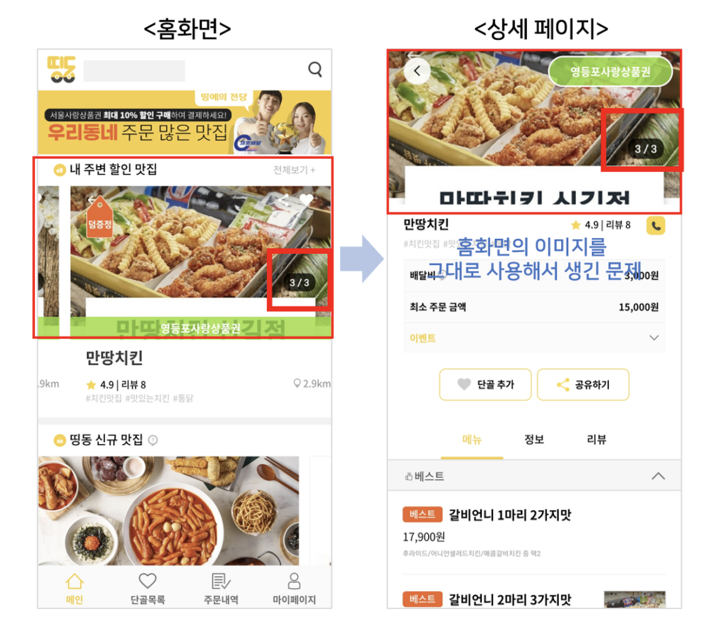
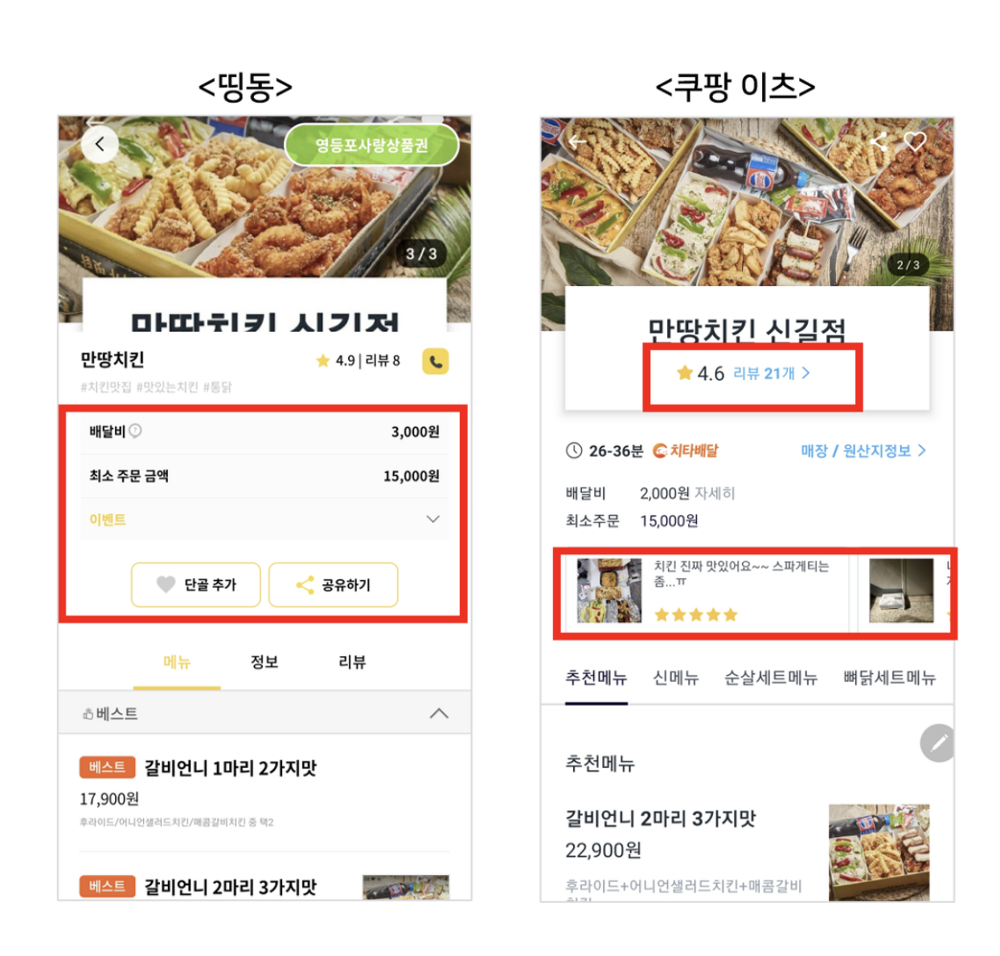
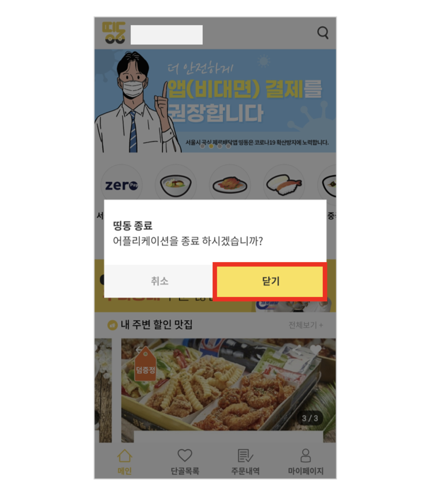

# 공공 배달 앱, 정말 배달 음식 주권 회복이 가능할까?

### 링크

- [글](https://brunch.co.kr/@jwj8906/24)

### 정리

- 공공 배달 앱인 띵동과 쿠팡이츠 비교

- 서비스의 사용성 - 보기 좋은 떡이 먹기도 좋은 법 (편견을 극복하기 위해 디자인과 사용성에 신경 많이 써야 한다)

- 띵동은 디테일에 약한 모습 - 규격에 맞지 않은 이미지 사용 및 상세 페이지에서도 그대로 사용해서 완성도 떨어진다

  

- 정보를 제공할 때, 필요한 정보를 보기 쉽게 제공하자

  

- 서비스 이용 flow를 고려하자

- 이해하기 쉬운 언어를 사용하자

  

- **디테일이 쌓여 "왠지 모르게 쉽고 편안한" 서비스가 된다**